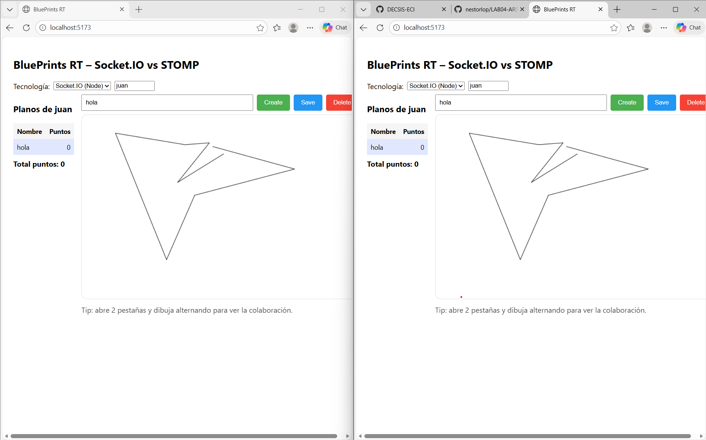

# BluePrints RealTime - LAB04-ARSW

## Descripción

Aplicación de colaboración en tiempo real para dibujar planos (BluePrints). Permite a múltiples usuarios dibujar en el mismo plano simultáneamente desde diferentes pestañas/navegadores.

## Arquitectura

```
React (Vite) + Canvas
        │
        ├── HTTP (REST CRUD) ──> Node.js + Express + Socket.IO
        │
        └── Socket.IO ( Tiempo Real )
```


### Prerrequisitos
- Node.js 18+
- npm

### 1. Backend

```bash
cd example-backend-socketio-node-
npm install
npm run dev
```
- **Puerto:** 3001
- **API Base:** http://localhost:3001

### 2. Frontend

```bash
cd LAB04-ARSWW
npm install
npm run dev
```
- **Puerto:** 5173
- **URL:** http://localhost:5173

## Endpoints REST

| Método | Endpoint | Descripción |
|--------|----------|-------------|
| GET | `/api/blueprints?author=:author` | Lista todos los planos de un autor |
| GET | `/api/blueprints/:author/:name` | Obtiene los puntos de un plano |
| POST | `/api/blueprints` | Crea un nuevo plano |
| PUT | `/api/blueprints/:author/:name` | Actualiza los puntos de un plano |
| DELETE | `/api/blueprints/:author/:name` | Elimina un plano |

## Tiempo Real (Socket.IO)

### Eventos

| Evento | Dirección | Descripción |
|--------|-----------|-------------|
| `join-room` | Cliente → Servidor | Se une a la sala del plano |
| `draw-event` | Cliente → Servidor | Envía un nuevo punto |
| `blueprint-update` | Servidor → Clientes | Broadcast de puntos actualizados |

### Convenciones
- **Sala:** `blueprints.{author}.{name}`
- **Payload punto:** `{ x: number, y: number }`

## Uso de la Aplicación

1. **Seleccionar tecnología:** Socket.IO (Node) o STOMP (Spring)
2. **Ingresar autor:** Escribir el nombre del autor
3. **Crear plano:** Escribir nombre y presionar "Create"
4. **Dibujar:** Hacer clic en el canvas
5. **Colaborar:** Abrir otra pestaña con el mismo autor y plano
6. **Guardar:** Presionar "Save" para persistir cambios
7. **Eliminar:** Presionar "Delete" para borrar el plano

## Features Implementados

- CRUD de planos (Create, Read, Update, Delete)
- Panel de autor con lista de planos y total de puntos
- Canvas interactivo con dibujo por clic
- Tiempo real con Socket.IO
- Soporte para STOMP (Spring Boot)

## Pruebas 
Para las pruebas se corre el proyecto y se crea un nuevo plano y dibujamos, a su vez vamos comprobando con otro que vamos a abrir en una nueva pestaña

### Video prueba
https://youtu.be/ePVd4lLVToI

## Decisiones Técnicas

- **Socket.IO:** Elegido como tecnología principal por su simplicidad y integración con Node.js
- **Rooms:** Aislamiento por autor y nombre de plano

## Limitaciones

- Los datos se pierden al reiniciar el servidor (sin persistencia)
- No hay autenticación/autorización
- No hay validación de entrada robusta

## Repositorios de Referencia

- Backend Socket.IO: `example-backend-socketio-node-`
- Frontend: `LAB04-ARSWW`

---

**Autor:** Nestor David Lopez Castañeda
**Fecha:** 2026
